# Table of Contents

- 1. [Problem and Data Description](#1-problem-and-data-description)
- 2. [Project Steps](#2-problem-steps)
- 3. [Architecture](#3-architecture)
- 4. [Technologies](#4-technologies)
- 5. [Prerequisites](#5-prerequisites)
  - 5.1. [Cloud Account](#51-cloud-account)
    - 5.1.1. [Account](#511-account)
    - 5.1.2. [Project](#512-project)
    - 5.1.3. [APIs](#513-apis)
    - 5.1.4. [Service Account](#514-service-account)
    - 5.1.5. [Service Account Key](#515-service-account-key)
- 6. [Cloud Environment](#6-cloud-environment)
  - 6.1. [VM Preparing](#61-vm-preparing)
  - 6.2.[Repository](#62-repository)
- 7. [Local Environment](#7-local-environment)
  - 7.1. [Credentials Env Variable](#71-credentials-env-variable)
  - 7.2. [Terraform](#72-terraform)
- 8. [Project Execution](#8-project-execution)
  - 8.1. [Data ingestion](#81-data-ingestion)
    - 8.1.1. [Python](#811-python)
    - 8.1.2. [Prefect](#812-prefect)
  - 8.2. [Data Warehouse](#82-data-warehouse)
  - 8.3. [Transformation](#83-transformation)
  - 8.4. [Dashboard](#84-dashboard)

# 1. Problem and Data Description

Here is my project carried out as part of the Data Engineering Zoomcamp 2023 which consists of putting into practice everything we have learned. I use the ELT approach, which stands for Extract, Load and Transform for this project.

I used data about the number  
and types of applications from the [HM Land Registry complete each month](https://use-land-property-data.service.gov.uk/datasets/td/download) in 2022 for this project.   
Specifically the "Number and types of applications by **all account customers**".  
You can see dataframe for 4 months of the year 2022 in the figure below.
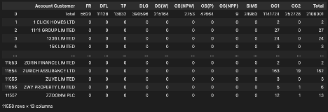

# 2. Project Steps

The steps for carrying out this project and assessing the data are as follows:  
1. Create the Local and Cloud Environment, we need to execute this Project.
2. Download the data, clean and transform it.
3. Upload this data to Google Cloud Storage and BigQuery
4. Use Dbt to transform this data within the BigQuery Data Warehouse
5. Create Visuals with Metabase based on the transformed data in the BigQuery Data Warehouse

# 3. Architecture

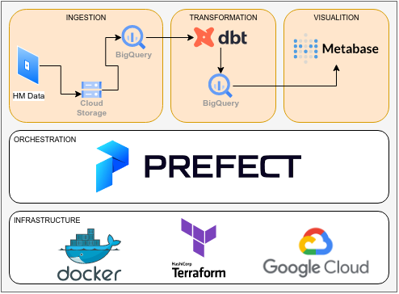

# 4. Technologies

The project is built on the following technologies (which, in case you chance to learn about it here and would like to look at the comprehensive information, are also utilized in the de-zoomcamp 2023):

Cloud platform (Service Account/IAM, Virtual Machine, Storage/Datalake, Warehouse, Visualization): __GCP__ 
Infrastructure as code (IaC): __Terraform__
Containerization: __Docker__
Batch processing: __Python/Pandas__
Enviroment Management: __Conda__
Data lake: __Google Storage__
Data warehouse: __Google Big Query____
Data transformation: __dbt__
Workflow orchestration: __Prefect__
Data visualization: __Metabase__

# 5. Prerequisites

## 5.1. Cloud Account
 
### 5.1.1 Account  
Create a Google Cloud account, [Register here]( https://console.cloud.google.com/)

 

### 5.1.2. Project  
I created a project with the name "dtc-de-383113" on the [GCloud Site](https://console.cloud.google.com/).  
On the top left you can click on the name of the current project 
and select "New Project" on the top right.  

 

### 5.1.3. APIs  
Enable the following APIs. The Project-Name on the top left must be "dtc-de-383113".   
* https://console.cloud.google.com/apis/library/iam.googleapis.com
* https://console.cloud.google.com/apis/library/iamcredentials.googleapis.com

 

### 5.1.4. Service Account
We will need a account for the communication with our Cloud environment. 
In GCloud open the menu on the left top.  
Choose "IAM & Admin". 
On the menu left select "Service accounts",  
Click on "Create Service Account" and create a new account 
with the name "service_account_dtc-de-383113".  
Add the following roles:  
Viewer, Storage Admin, Storage Object Admin,  BigQuery Admin

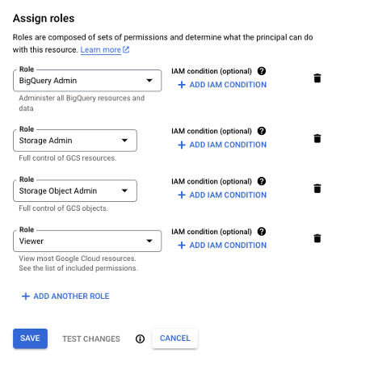

 

### 5.1.5. Service Account Key
We need the authorization key for the created service account.  
In the Menu "Service Accounts" click in the list on the name of the account,    
we created in the previous step. The go to the "KEYS" Tab, "Add Key"    
"Create new key". Choose Json and save the file.  
Rename the file to 'service_account_dtc-de-383113.json' and    
save it to your home folder in  `$HOME/.google/`.  
Save this file also later, when we create the VM.    

 

# 6. Cloud Environment

We will execute everything on the cloud environment.  
We have to prepare the Virtual Machine. The best OS for this project is **Linux**.  

## 6.1. VM Preparing

You can find a detailed Video about setting up the cloud VM [here](https://www.youtube.com/watch?v=ae-CV2KfoN0&list=PL3MmuxUbc_hJed7dXYoJw8DoCuVHhGEQb).  

This things will be executed:

- Generating SSH keys
  - Follow the Instruction on the [GCP Doc Site](https://cloud.google.com/compute/docs/connect/create-ssh-keys) based on your OS System.
- Creating a virtual machine on GCP
  - Go to your _GCP Project_ -> Open the Menu and choose _Compute Engine_ -> _VM Instances_
  - _Create Instance_ and select the Settings of the VM based on your personal needs.
- Connecting to the VM with SSH or use Visualstudio Code Remote SSH
- Installing Conda
 ~~~shell
  sudo apt-get update
  sudo apt-get upgrade
  wget https://repo.anaconda.com/archive/Anaconda3-2023.03-Linux-x86_64.sh
  sha256sum Anaconda3-2023.03-Linux-x86_64.sh
  bash Anaconda3-2023.03-Linux-x86_64.sh
  ~~~
- Installing [Docker](https://docs.docker.com/engine/install/)
  - Based on your OS System install Docker
  - For Ubuntu you have to execute this steps in a Terminal:  
  ~~~shell
  sudo apt-get install ca-certificates curl gnupg
  sudo mkdir -m 0755 -p /etc/apt/keyrings
  curl -fsSL https://download.docker.com/linux/ubuntu/gpg | sudo gpg --dearmor -o /etc/apt/keyrings/docker.gpg
  sudo apt-get update
  sudo apt-get install docker-ce docker-ce-cli containerd.io docker-buildx-plugin docker-compose-plugin
  sudo groupadd docker
  sudo usermod -aG docker $USER
  ~~~

## 6.2. Repository

If you finished all the points in the previous step,  
then the VM is ready to be used.  
Connect to the VM for example with Visual Studio Code Remote SSH.  
Clone this repository into your **home folder**.

~~~shell
cd $HOME
git clone https://github.com/yalcinerbasi/data-engineering-zoomcamp-project.git
~~~

 

# 7. Local Environment

## 7.1. Credentials Env Variable  
We have to set the path to the credentials json file and save it in a variable.  
`export GOOGLE_APPLICATION_CREDENTIALS="<path/to/your/service-account-authkeys>.json"`.  
We will save it in the .bashrc file in the home folder.  
The following command will add `GOOGLE_APPLICATION_CREDENTIALS="$HOME/.google/service_account__dtc-de-383113.json"`  
at the end of the .bashrc file.  

~~~sh
echo GOOGLE_APPLICATION_CREDENTIALS="$HOME/.google/service_account_dtc-de-383113.json" >>  $HOME/.bashrc
~~~
or 
~~~sh
export GOOGLE_APPLICATION_CREDENTIALS="$HOME/.google/service_account_dtc-de-383113.json"
~~~

## 7.2. Terraform

Terraform is a Infrastructure as Code Tool that lets you build, change and version cloud and on-prem resources safely and efficiently.  
With the help opf terraform, we will create the create the infrastructure  
For this Project we need on GCP resources.  
We will create
   - GC Bucket
   - Big Query Dataset

First we need to install terraform on our local machine.  
Follow Instruction based on your local operating system.  
[Terraform install instruction](https://developer.hashicorp.com/terraform/downloads)  

We need the Google SDK for authentication when we use terraform  
https://cloud.google.com/sdk/docs/install-sdk

 

First we need to authorize:

~~~sh
gcloud auth application-default login
~~~

Open the link in the browser and copy and paste the 
authorization code.  

After that we initialize terraform,
we need to be in the ./01_Infrastructure folder.
In the folder are the codes for the infrastructure, we want to create.  

~~~sh
cd $HOME/data-engineering-zoomcamp-project/01_Infrastructure/

terraform init

# First we plan and check changes to new infra plan
terraform plan -var="project=<your-gcp-project-id>"
# Create new infra
terraform apply -var="project=<your-gcp-project-id>"

# For our exapmple it is: 
terraform plan -var="project=dtc-de-383113"
terraform apply -var="project=dtc-de-383113"
~~~

**Important note**: When you finished your project, don't forget to destroy all remote objects managed by a our Terraform configuration to avoid incurring unnecessary charges to your GCP account, 

~~~sh
terraform destroy
~~~

You can also manually delete your Virtual Environment, Bucket and BigQuery ressource and perhaps your Google Cloud project.

# 8. Project Execution

## 8.1. Data ingestion 
 

### 8.1.1 Python 

We will execute Python Scripts.  
Therefor we will create a Conda Enviornment "dataeng"   
and install all the Python Package Dependencies ("requirements.txt").    

~~~shell
cd $HOME/data-engineering-zoomcamp-project
conda create -n dataeng
conda activate dataeng
pip install -r requirements.txt
~~~
 
We will use the same Conda Enviroment which we created above for next steps.  
 

### 8.1.2. Prefect

We will use Prefect as our orchestration Tool.  
With the help of Prefect we will execute the Extract, Transform  
and Load Python Script.  

Open a new terminal and execute:  

~~~shell
conda activate dataeng
prefect orion start
~~~

Open the Browser and go to [Prefect UI](http://127.0.0.1:4200)

We need to authorize Prefect with our GCP Account.  
Therefore, we will use the service account credentials.  
Open the Json Service account file in `$HOME/.google/service_account_dtc-de-383113.json`  
and copy the content of the file.  

Go in the Prefect UI to "Blocks" and create a new block,  
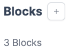  
and choose `GCP Credentials`.  
Block Name: de-gcp-cred 
Paste the Json dictionary into the blue field,  
and the Project Name is dtc-de-383113.  
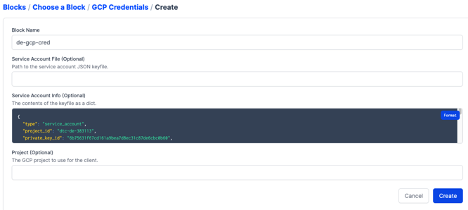

**Important note**: if GCS Bucket is not available, go to the terminal and run:

~~~shell
prefect block register -m prefect_gcp
~~~

We create another Block, this time "GCS Bucket".  
At "Gcp Credentials" choose the one you created earlier.
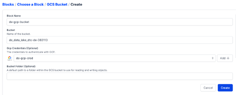

Now we can execute the Python ETL Script

Convert to .ipynb file to .py file:  

~~~shell
cd data-engineering-zoomcamp-project
conda activate dataeng
jupyter nbconvert --to script 02-Orchestration/extract_load_transfortm_web_to_local_to_gcs_to_bq.ipynb 
~~~

Execute the following code in a shell terminal:  

~~~shell
python 02-Orchestration/extract_load_transfortm_web_to_local_to_gcs_to_bq.py 
~~~

The Script downloads the csv Files from the UK Government Site,  
transform them and uploads them to Google Cloud Bucket and BigQuery.  

When you jump back to the Prefect UI,  
choose "etl-web-to-local-to-gcs-to-bq" in the "FLows" Tab,  
you can see all runs for this Script and detailed Logs and Radar.  

## 8.2. Data Warehouse

The data we want to analyze is now on BigQuery.      
As you can see in the details of the table,    
it is not optimized, no Partition, no Cluster.  

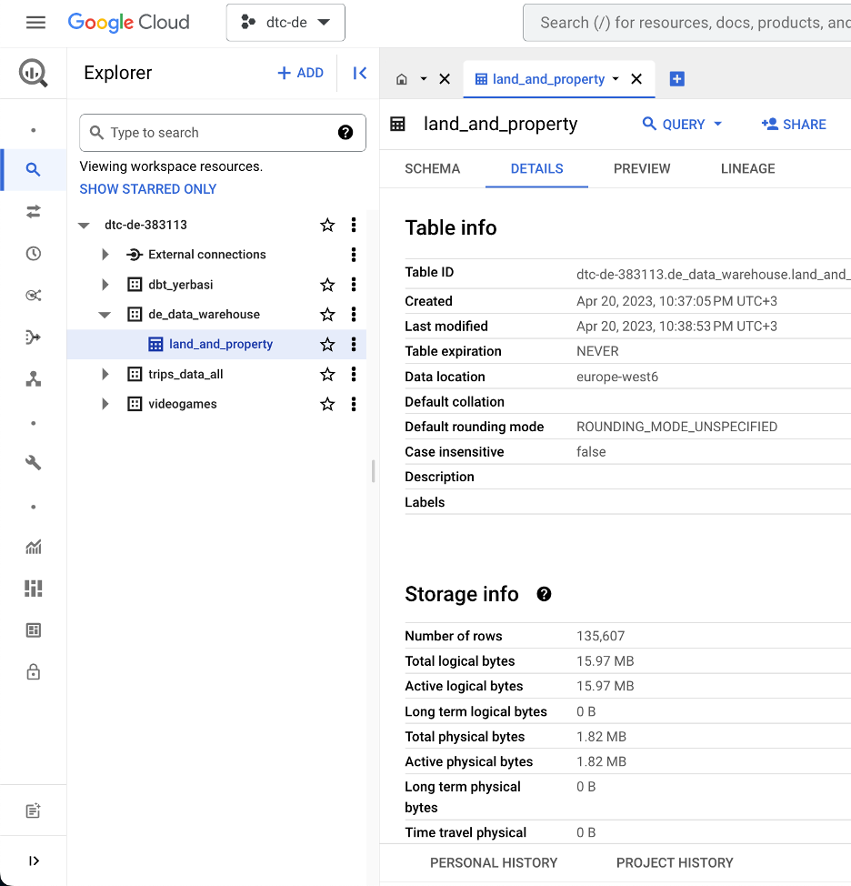

We will order the data by date column "date_added",  
so we will Cluster based on this column.  
We will group the data by the Customer,  
so we will Partition by "Account_Customer".   

Execute ths SQL Script to create the new table "land_and_property_optimized".  

~~~sql
CREATE TEMP TABLE temp_table AS
SELECT * EXCEPT(date_added),
  SAFE.PARSE_DATE('%Y-%m-%d', date_added) AS date_added
FROM `dtc-de-383113.de_data_warehouse.land_and_property`;

CREATE OR REPLACE TABLE `dtc-de-383113.de_data_warehouse.land_and_property_optimized`
PARTITION BY date_added
CLUSTER BY Account_Customer 
AS SELECT * FROM temp_table;
~~~

Now we see in the details, that the table is partitioned and clustered.  

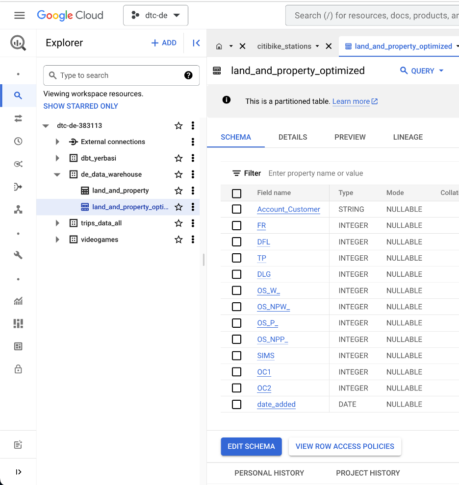

## 8.3. Transformation

The data we want to analyze is ready and optimized in BigQuery.  
We will now use Dbt locally and do some transformations within the Data Warehouse.  

The dbt folder is in `$HOME/data-engineering-zoomcamp-project/03-Transformation`.

The Lineage of this dbt project is this:  
First we have an landing area _**Raw**_, than the _**Transform**_ Layer,  
and than the _**Core**_ Layer, were we will use `final_land_and_property` table in Metabase.  

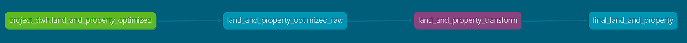

To create a connection and authorization,  
we have to create a dbt profile file in `$HOME/.dbt/profiles.yml`  
The Keyfile is the Path to the service account json credentials file in  
`$HOME/.google/service_account_dtc-de-383113.json`  

~~~shell
my-bigquery-db:
  target: dev
  outputs:
    dev:
      type: bigquery
      method: service-account
      project: [GCP project id]
      dataset: [the name of your dbt dataset]
      threads: [1 or more]
      keyfile: [/path/to/bigquery/keyfile.json]
~~~

For this project, I used this one as profiles.yml,    
edit the keyfile path:  

~~~
dtc-de-383113:
  outputs:
    dev:
      dataset: trips_data_all
      job_execution_timeout_seconds: 300
      job_retries: 1
      keyfile: [/path/to/bigquery/keyfile.json]
      location: europe-west6
      method: service-account
      priority: interactive
      project: dtc-de-383113
      threads: 4
      type: bigquery
  target: dev
~~~

Also, you need to add packages.yml file:
~~~
packages:
  - package: dbt-labs/dbt_utils
    version: 1.0.0
  - package: dbt-labs/codegen
    version: 0.9.0
  - package: elementary-data/elementary
    version: 0.7.5
    ## Docs: https://docs.elementary-data.com
~~~

You can find the detailed BigQuery Setup Documentation of Dbt [here](https://docs.getdbt.com/reference/warehouse-setups/bigquery-setup).  

Open a terminal and switch to the Dbt folder,
we will execute this steps,  
so it will create the views and tables for us based on our dbt models.  

~~~sh
conda activate dataeng
cd $HOME/data-engineering-zoomcamp-project/03-Transformation
dbt deps
dbt run
~~~

The successful result in the termninal looks like this:  

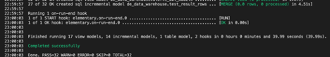

After the process we have new objects in BigQuery based on the models we have defined in the Dbt folder.   

 

## 8.4 Dashboard

Now we want to visualize the data,  
we transformed with dbt in the previous step.  

Therefor we will use Metabase locally with Docker.

Open a terminal and execute:

~~~sh
docker run -d -p 3000:3000 --name metabase metabase/metabase:v0.46.0
~~~

The Metabase UI will be available on `<ip of the machine>:3000`.  

Go though the initial Setup of Metabase.  
In Step 3 "Add your data" choose BigQuery.  
Fill everything with your data and select the service account json file  
from your local machine.  

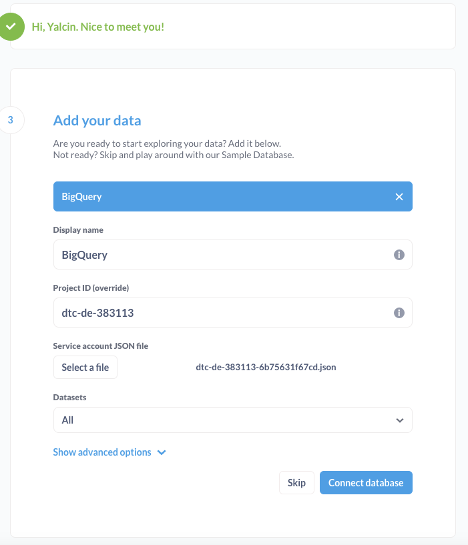

Now we can use the data from BigQuery in Metabase.  
We can use Metabase`s SQL Query and execute our own SQL Queries.  
Than we have the result as a visual and add it to a dashboard.  

We want to know the Top 10 Number of Applications per Customer.  

~~~sql
SELECT
customer,
COUNT(*) as number_of_customer_applications
FROM `dtc-de-383113`.de_data_warehouse.final_land_and_property
GROUP BY customer
ORDER BY COUNT(*) DESC
LIMIT 10
~~~

3 Customers have more applications than the other 7 together in the Year 2022.  

Number of Applications per Month

~~~sql
SELECT
DATE_TRUNC(date_added, MONTH),
COUNT(*) as number_of_applications
FROM `dtc-de-383113`.de_data_warehouse.final_land_and_property
GROUP BY date_added
ORDER BY date_added
~~~

